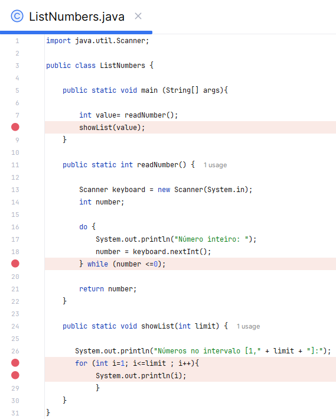
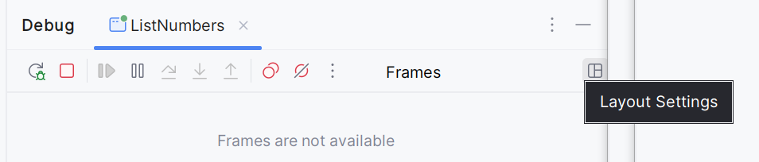
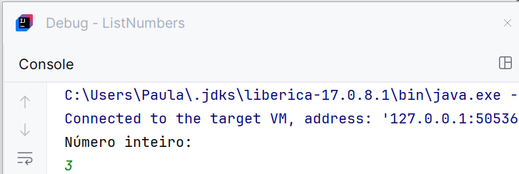
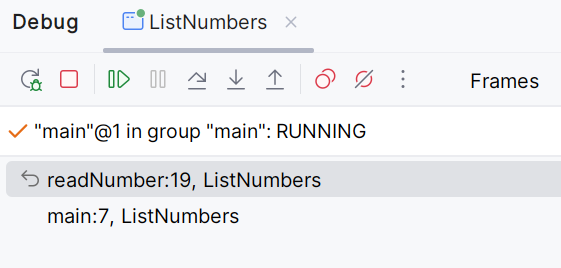
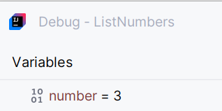

# Lab 3B - Introdução à Linguagem Java (Sintaxe e Depuração)

## Aplicações Java 

:dart: Desenvolva os seguintes programas com recurso ao IDE `IntelliJ IDEA`, criando um novo projeto (e.g. `Lab3B `).

:warning: Crie os diferentes programas em _classes_ separadas.

:warning: Não se esqueça de guardar o seu trabalho!  

## Exercícios :pen:


1. Crie um programa (`ListNumbers`) que mostra todos os número inteiros compreendidos entre `[1, n]`, sendo `n` introduzido pelo utilizador.

    🅰️ Defina uma função  (`readNumber`) que solicita ao utilizador um número inteiro e devolve o número se este for maior que zero.

    🅱️ Defina uma outra função (`showList`) que recebe um número inteiro e mostra a lista de números no intervalo `[1 , n]`.

    📝Invoque e teste ambas as funções no programa.

---

2. :hammer_and_wrench: Faça a depuração (***Debug***) do programa anterior.
    

    O processo de ***Debug*** é muito importante para despistar erros no desenvolvimento de software. Permite ao programador uma análise detalhada dos valores das variáveis, em momento de execução do programa. O `IntelliJ IDEA `incluí um módulo dedicado a esta componente. Segue o exemplo de depuração do programa anterior.

    Primeiro será necessário identificar os pontos de paragens (***breakpoints***) que identificam a linha de código em que será feita uma análise do resultado da execução. 


    :stop_sign: Coloque os ***breakpoints*** nas linhas indicadas, conforme imagem abaixo.

    :bulb: Para definir um ***breakpoint*** clique com o botão esquerdo na barra lateral esquerda ou clicando no local do código e pressionando **Ctrl + F8**.

    

    Para iniciar o processo de ***Debug*** deve selecionar : ` Run > Debug ... `

    

    ​O programa será executado, sequencialmente, até chegar a primeiro  ***breakpoint*** .

    ​Para prosseguir com a execução do programa devemos selecionar a opção que permite continuar : 

    ​
        
    A informação referente aos pontos de paragem pode ser observada. Para tal:

    - [ ] Pressione **Alt + 5** para visualizar a janela de ***Debug***

        


    - [ ] No ***Layout Settings*** escolha ver a janela das variáveis e da consola, para acompanhar todo o processo.

    - [ ] Introduza o número na janela da ***Console***.
    
        

    - [ ] Após inserir o número verifique as janelas: ***Frames*** ( podemos verificar que se  encontra na linha 19, função `readNumber`) e ***Variables*** (podemos verificar que a variável `number` armazena o valor 3 introduzido pelo utilizador).

        

        


    - [ ] Continue a depuração, analisando cuidadosamente todo o processo, até terminar o programa.


---

3. Crie um programa (`SecondGradeEquation`) que determine os zeros de uma equação do segundo grau. 
   
   
   $$
   ax^2 + bx + c = 0
   $$
   
   $$
   x = \frac{-b \pm \sqrt{b^2 - 4ac}}{2a}
   $$
   
   
   
   O valor 
   $$
   b^2 - 4ac
   $$
   é chamado de discriminante da equação de 2º  grau.
   
   
   
   O problema deve contemplar os casos em que o coeficiente de termo quadrático é zero e as raízes são complexas. Assim, nestes casos o utilizador deverá ser informado do seguinte:
   
   - se a = 0, então "Não se trata de uma função quadrática",
   - se o discriminante for negativo, então "As raízes são complexas",
   - caso contrário, deverão ser mostrar as duas raízes da equação.
   
   
   
   🅰️ Defina uma função com a seguinte assinatura:
   
   ```java
   int discriminant(int a, int b, int c);
   ```
   
   que recebe três valores inteiros por parâmetro, correspondentes aos coeficientes da equação de 2º grau, e devolve o valor do discriminante.
   
   🅱️ No programa, solicite ao utilizador  os valores dos coeficientes (**a** e **b**) e da constante **c**, presentes na equação. Invoque a função anterior, que vai permitir analisar a natureza das raízes da equação, mostrando o resultado.
   
   :bulb: A maneira mais comum de calcular a raiz quadrada em Java é usando 
   
   ```
   Math.sqrt(...)
   ```
   
    com a assinatura 
   
   ```java
   double sqrt (int double a);
   ```
   
   

---

4. Crie um programa  (`SumDigits`) que receba um número inteiro e que apresente ao utilizador a soma dos seus dígitos.

    🅰️ Reutilize a função (`readNumber`) criada no exercício 1.
    
    🅱️ Defina uma outra função (`sumDigits`) que recebe um número inteiro e retorna a soma dos dígitos.
    
    📝Invoque e teste ambas as funções no programa.

---

5. Crie um programa (`Averages `) que mostra a média das notas de um estudante.

    🅰️ Defina uma função  (`average`) que recebe 3 notas de um estudante e uma letra, por parâmetros e retorna a média. Se a letra for 'A' a função calcula a média aritmética das notas, se for 'P' calcula a sua média ponderada (pesos 5, 3 e 2, respetivamente). Se não for nenhuma destas letras, devolve `-1`.

    🅱️ Defina uma função  (`readAverageMode`) que solicita ao utilizador um carácter "válido" para o cálculo da média.

    :arrows_counterclockwise: Redefina a função  (`readNumber`) criada no exercício 1, para  (`readReal`), para ler números reais.

    📝Invoque e teste as funções no programa.

---

paula.miranda@estsetubal.ips.pt e bruno.silva@estsetubal.ips.pt